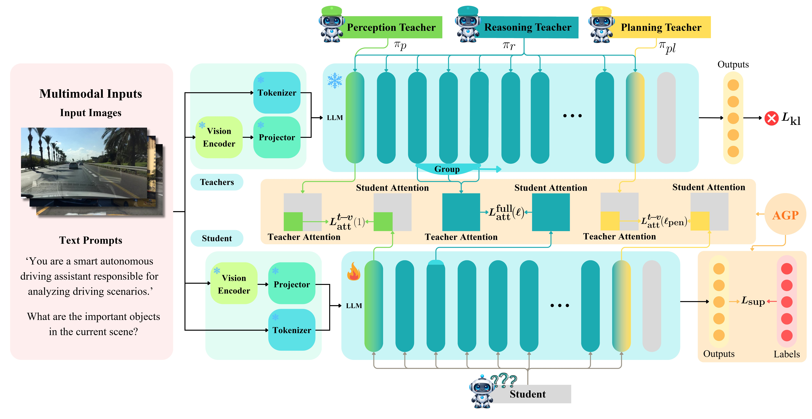
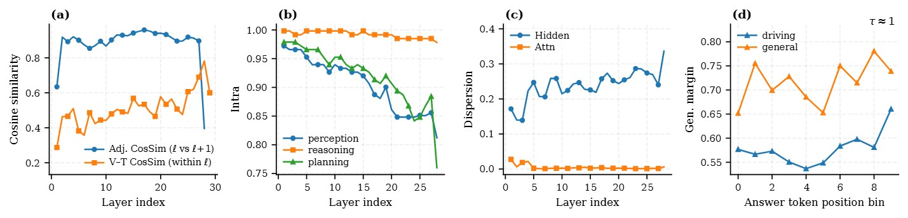
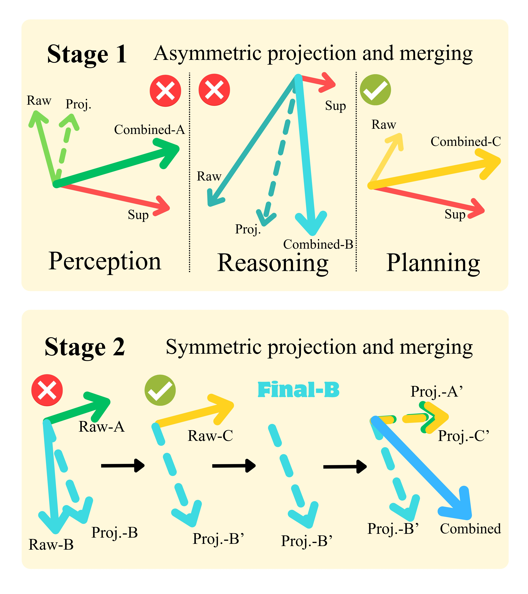

<p align="right">English | <a href="./README_CN.md">简体中文</a></p>

<div align="center">

# Drive-KD: Multi-Teacher Distillation for VLMs in Autonomous Driving

**Weitong Lian<sup>1,\*</sup>, Zecong Tang<sup>1,\*</sup>, Haoran Li<sup>1,\*</sup>, Tianjian Gao<sup>1</sup>, Yifei Wang<sup>1</sup>, Zixu Wang<sup>1</sup>, Lingyi Meng<sup>1</sup>, Tengju Ru<sup>1</sup>, Zhejun Cui<sup>1</sup>, Yichen Zhu<sup>1</sup>, Hangshuo Cao<sup>1</sup>, Qi Kang<sup>1</sup>, Tianxing Chen<sup>2</sup>, Yusen Qin<sup>3</sup>, Kaixuan Wang<sup>2</sup>, Yu Zhang<sup>1,†</sup>**

<sup>1</sup>Zhejiang University, Hangzhou, China &nbsp;&nbsp; <sup>2</sup>The University of Hong Kong, Hong Kong, China &nbsp;&nbsp; <sup>3</sup>D-Robotics, Shenzhen, China  
<sup>*</sup>Equal contribution &nbsp;&nbsp; <sup>†</sup>Corresponding author

[](https://arxiv.org/abs/2601.21288)



</div>

Drive-KD is a **multi-teacher knowledge distillation** framework for **autonomous-driving vision-language models (VLMs)**.  
We decompose driving into a sequential triad—**perception → reasoning → planning**—and transfer capability-specific behaviors via **layer-specific attention distillation** and **Asymmetric Gradient Projection (AGP)** to mitigate cross-capability conflicts.

---

## ✨ Highlights

- **Capability decomposition:** a sequential triad (**perception–reasoning–planning**) consistent with human driving thought processes.
- **Distillation signal selection:** via four pre-studies—(a) Layer-wise distillation alignment, (b) Capability-wise intra-group similarity, (c) Layer-wise dispersion of hidden states & attention maps, and (d) Position-normalized generalized margin—we explore signal selection strategies.
- **Single-teacher recipes (capability-specific):**
  - **Perception:** Layer-1 **text-to-vision** attention distillation.
  - **Reasoning:** **Intermediate-layer** attention distillation with **layer-group matching**.
  - **Planning:** **Penultimate-layer** **text-to-vision** attention distillation.
- **Multi-teacher distillation:** unify three specialized teachers with a capability-aware mixing matrix.
- **AGP:** a two-stage gradient projection scheme that reduces cross-capability gradient conflicts.
- **Efficiency–performance:** distilled **InternVL3-1B** achieves **~42× less GPU memory** and **~11.4× higher throughput**, outperforming the pretrained **InternVL3-78B** overall on DriveBench and surpassing **GPT-5.1** on planning.

---

## 🧩 Method Overview

### Pre-study (signal & layer selection)

<p align="center">
  <br/>
  <em>Pre-study summary for InternVL3-8B: (a) layer-wise distillation alignment measured by cosine similarity (adjacent-layer and within-layer vision–text), (b) capability-wise intra-group similarity across layers, (c) layer-wise dispersion of hidden states and attention maps (1−cos), and (d) position-normalized generalized margin along the answer segment comparing driving and general data at τ≈1.0.</em>
</p>

### Asymmetric Gradient Projection (AGP)

<p align="center">
  <br/>
  <em><b>Asymmetric Gradient Projection (AGP).</b> Stage 1 uses an asymmetric anchor–follower projection within each capability and merges the resulting update. Stage 2 applies shuffled symmetric pairwise projections across capabilities to obtain the final gradient direction.</em>
</p>

---

## 📊 Results (DriveBench)

### Table 1: Capability scores & deployment metrics

<table>
<thead>
<tr>
  <th rowspan="2">Model</th>
  <th colspan="4">Capability scores (%)</th>
  <th colspan="3">Deployment metrics</th>
</tr>
<tr>
  <th>Perception</th><th>Reasoning</th><th>Planning</th><th>Avg.</th>
  <th>Memory (GB)</th><th>Speed (tok/s)</th><th>1st-token (s)</th>
</tr>
</thead>
<tbody>
<tr><td><b>GPT-5.1</b></td><td>45.56</td><td>41.02</td><td>51.94</td><td><b><u>46.17</u></b></td><td>-</td><td>-</td><td>-</td></tr>

<tr><td colspan="8"><b>InternVL3 (pretrained)</b></td></tr>
<tr><td>InternVL3-1B</td><td>33.26</td><td>20.96</td><td>22.36</td><td>25.53</td><td><b><u>4.1</u></b></td><td><b><u>45.7</u></b></td><td><b><u>0.45</u></b></td></tr>
<tr><td>InternVL3-2B</td><td>37.71</td><td>35.99</td><td>26.19</td><td>33.30</td><td>6.3</td><td>39.9</td><td>0.67</td></tr>
<tr><td>InternVL3-8B</td><td>40.05</td><td>41.15</td><td>32.77</td><td>37.99</td><td>18.3</td><td>32.6</td><td>1.58</td></tr>
<tr><td>InternVL3-14B</td><td>39.83</td><td>40.84</td><td>36.35</td><td>39.01</td><td>33.4</td><td>17.0</td><td>3.01</td></tr>
<tr><td>InternVL3-38B</td><td>34.27</td><td>38.48</td><td>40.65</td><td>37.80</td><td>87.0</td><td>7.3</td><td>9.84</td></tr>
<tr><td>InternVL3-78B</td><td>42.01</td><td><b><u>47.16</u></b></td><td>36.31</td><td>41.83</td><td>171.6</td><td>4.0</td><td>16.46</td></tr>

<tr><td colspan="8"><b>Qwen2.5-VL (instruct)</b></td></tr>
<tr><td>Qwen2.5-VL-3B-Instruct</td><td>35.46</td><td>30.81</td><td>25.29</td><td>30.52</td><td>8.5</td><td>28.0</td><td>0.68</td></tr>
<tr><td>Qwen2.5-VL-7B-Instruct</td><td>36.26</td><td>37.54</td><td>32.84</td><td>35.55</td><td>17.1</td><td>32.0</td><td>0.87</td></tr>
<tr><td>Qwen2.5-VL-32B-Instruct</td><td>38.41</td><td>41.30</td><td>34.29</td><td>38.00</td><td>69.5</td><td>10.8</td><td>2.36</td></tr>
<tr><td>Qwen2.5-VL-72B-Instruct</td><td>23.78</td><td>27.67</td><td>50.76</td><td>34.07</td><td>146.5</td><td>5.8</td><td>4.26</td></tr>

<tr><td colspan="8"><b>Llama-3.2-Vision (instruct)</b></td></tr>
<tr><td>Llama-3.2-11B-Vision-Instruct</td><td>31.59</td><td>32.91</td><td>29.34</td><td>31.28</td><td>26.2</td><td>16.8</td><td>1.55</td></tr>
<tr><td>Llama-3.2-90B-Vision-Instruct</td><td>27.26</td><td>26.33</td><td>27.72</td><td>27.10</td><td>183.6</td><td>2.7</td><td>8.05</td></tr>

<tr><td colspan="8"><b>Drive-KD (distilled)</b></td></tr>
<tr><td>InternVL3-1B (Single)</td><td>43.13</td><td>34.32</td><td>52.97</td><td>43.47</td><td><b><u>4.1</u></b></td><td><b><u>45.7</u></b></td><td><b><u>0.45</u></b></td></tr>
<tr><td>Qwen2.5-VL-3B-Instruct (Single)</td><td>45.59</td><td>34.47</td><td>51.97</td><td>44.01</td><td>8.5</td><td>28.0</td><td>0.68</td></tr>
<tr><td>InternVL3-1B (Multi)</td><td>43.50</td><td>33.15</td><td><b><u>55.51</u></b></td><td>44.05</td><td><b><u>4.1</u></b></td><td><b><u>45.7</u></b></td><td><b><u>0.45</u></b></td></tr>
<tr><td>Qwen2.5-VL-3B-Instruct (Multi)</td><td><b><u>45.63</u></b></td><td>36.41</td><td>54.07</td><td>45.37</td><td>8.5</td><td>28.0</td><td>0.68</td></tr>
</tbody>
</table>

### Table 2: Distillation scaling across model sizes (InternVL3)

| Teacher | Student | Perception | Reasoning | Planning | Avg. |
|---:|---:|---:|---:|---:|---:|
| 8B  | 1B | **<u>43.50</u>** | 33.15 | 55.51 | 44.05 |
| 14B | 1B | 43.41 | 30.34 | 56.19 | 43.31 |
| 38B | 1B | 43.24 | 29.15 | 56.77 | 43.05 |
| 8B  | 2B | 43.14 | 36.97 | 56.01 | 45.37 |
| 14B | 2B | 41.74 | 35.40 | 56.84 | 44.66 |
| 38B | 2B | 42.87 | **<u>38.25</u>** | **<u>57.63</u>** | **<u>46.25</u>** |

### Table 3: Distillation signals & attention variants (InternVL3-1B)

> “--” indicates not applicable (the model is trained/evaluated on a single capability split only).

| Setting / Variant | Perception | Reasoning | Planning |
|---|---:|---:|---:|
| **Objectives (single-capability protocol)** ||||
| CE (SFT) | 40.86 | 29.05 | 45.63 |
| CE + KL | 39.60 | 28.16 | 43.36 |
| CE + Hidden (1) | 41.27 | -- | -- |
| CE + Hidden (mid) | -- | 31.65 | -- |
| CE + Hidden (penultimate) | -- | -- | 45.04 |
| **Additional attention variants** ||||
| CE + Full Attn (1) | 42.46 | -- | -- |
| CE + A<sub>t-v</sub> (mid) | -- | 30.42 | -- |
| CE + Full Attn (penultimate) | -- | -- | 51.47 |
| CE + A<sub>t-v</sub> (mid 2→penultimate−1) | -- | 31.43 | -- |
| CE + A<sub>t-v</sub> (1), cosine | 41.85 | -- | -- |
| CE + Full Attn (mid), cosine | -- | 32.87 | -- |
| CE + A<sub>t-v</sub> (penultimate), cosine | -- | -- | 51.76 |
| **Multi-teacher + conflict handling** ||||
| Multi-teacher (no projection) | 42.34 | 25.68 | 51.03 |
| Multi-teacher (G1) | 42.96 | 25.49 | 46.99 |
| Multi-teacher (G2) | 42.64 | 29.18 | 52.19 |
| **Ours (single-teacher)** | **<u>43.13</u>** | **<u>34.32</u>** | **<u>52.97</u>** |
| **Ours (multi-teacher + AGP)** | **<u>43.50</u>** | **<u>33.15</u>** | **<u>55.51</u>** |

---

## 🚀 Quickstart

### 1) Environment

Recommended: **Python 3.10+**, Linux, CUDA GPU (≥ 1 GPU).

```bash
pip install torch torchvision transformers accelerate tqdm pillow
```

### 2) Data

This repository includes `data/demo.json`, which provides **a few annotated samples** for format demonstration.  
**We do NOT provide the raw images**. Please download images from official sources:

- **nuScenes** (multi-view and single-view)
- **BDD100K** (single-view)

Then modify `images` paths in your JSON (or your loader) accordingly.

### 3) Prepare models

By default, `train.py` expects:

- Teacher: `models/InternVL3-8B`
- Student: `models/InternVL3-1B`
- Data: `data/demo.json`
- Checkpoints: `checkpoints/`

You can override them via CLI args.

### 4) Run training

Minimal example:

```bash
python train.py \
  --data-json data/demo.json \
  --teacher-model-path models/InternVL3-8B \
  --student-model-path models/InternVL3-1B \
  --epochs 1
```

Multi-teacher (optional):

```bash
python train.py \
  --data-json data/demo.json \
  --teacher-perception-path models/teacher_perception \
  --teacher-reasoning-path models/teacher_reasoning \
  --teacher-planning-path models/teacher_planning \
  --student-model-path models/InternVL3-1B
```

### 5) Key options (most used)

- Loss weights: `--w-ce`, `--w-perception`, `--w-reasoning`, `--w-planning`
- Teacher mixing weights (3 floats each):  
  - `--mix-perception` (e.g., `0.8,0.1,0.1`)  
  - `--mix-reasoning` (e.g., `0.1,0.8,0.1`)  
  - `--mix-planning` (e.g., `0.1,0.1,0.8`)  
- Online loss reweighting: `--use-dynamic-loss-weights` (and related args)
- AGP: `--use-agp`

> **Important notes for convergence:** loss weights, mixing weights, LR, and batch/accumulation **should be adjusted to your actual models/data** to ensure stable training and convergence.

---

## 📁 Repository Structure

```text
Drive-KD
├── README.md
├── README_CN.md
├── train.py
├── intern/
│   ├── trainer.py
│   ├── model.py
│   ├── qa_loader.py
│   ├── image_loader.py
│   └── markers.py
├── data/
│   └── demo.json
└── docs/
    └── figs/
        ├── pipeline.jpg
        ├── pre_study.jpg
        ├── AGP.jpg
        ├── perception_eval.jpg
        ├── reasoning_eval.jpg
        └── planning_eval.jpg
```

---

## 📌 Citation

```bibtex
@article{lian2026drivekd,
  title={Drive-KD: Multi-Teacher Distillation for VLMs in Autonomous Driving},
  author={Lian, Weitong and Tang, Zecong and Li, Haoran and Gao, Tianjian and Wang, Yifei and Wang, Zixu and Meng, Lingyi and Ru, Tengju and Cui, Zhejun and Zhu, Yichen and Cao, Hangshuo and Kang, Qi and Chen, Tianxing and Qin, Yusen and Wang, Kaixuan and Zhang, Yu},
  journal={arXiv preprint arXiv:2601.21288},
  year={2026}
}
```

---

## ⚖️ License

This project is released under the **Apache License 2.0**.

---

## 🙏 Acknowledgments

We thank the open-source community and dataset providers (nuScenes, BDD100K) that make this research possible.
